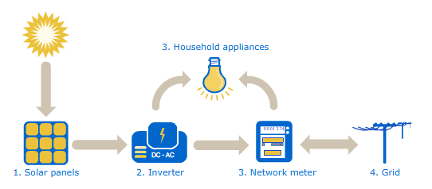

```{r setup, include=FALSE}
knitr::opts_chunk$set(
    echo = FALSE,
    message = FALSE,
    warning = FALSE,
    out.width = "100%",
    fig.align = "center")
```

```{r}
# Load libraries
library(tidyverse)
library(tidyquant)
library(lubridate)
library(plotly)
library(kableExtra)
```

```{r, load data}
# Load data
plant_1_weather_tbl <- read_csv('Data/Plant_1_Weather_Sensor_Data.csv')
plant_2_weather_tbl <- read_csv('Data/Plant_2_Weather_Sensor_Data.csv')

plant_1_generation_tbl <- read_csv('Data/Plant_1_Generation_Data.csv')
plant_2_generation_tbl <- read_csv('Data/Plant_2_Generation_Data.csv')
```

```{r, source functions}
# Import prepared functions
source('Scripts/weather_data_viz_functions.R')
source('Scripts/generation_data_viz_functions.R')
source('Scripts/identify_missing_periods_functions.R')
```

```{r, clean data}
# Clean up input data
plant_1_weather_tbl <- clean_weather_input_tibble(data = plant_1_weather_tbl)
plant_2_weather_tbl <- clean_weather_input_tibble(data = plant_2_weather_tbl)

plant_1_generation_tbl <- clean_generation_input_tibble(data = plant_1_generation_tbl, date_type = 'type_1')
plant_2_generation_tbl <- clean_generation_input_tibble(data = plant_2_generation_tbl, date_type = 'type_2')
```

# Articles in this Series

1. Introduction and exploratory data analysis
2. Inverter segmentation analysis
3. Forecasting power plant energy generation
4. Summary of findings

# Introduction

Solar power is a form of renewable clean energy that is created when photons from the sun excite elections in a photovoltaic panel, generating electricity. The power generated is usually tracked via sensor with measurements happening on a time based cadence. Solar power plants are made up of hundreds to thousands of panels, with groups of panels connected to a single inverter. Each solar panel produces direct current (DC) power, so it is the job of the inverter to convert the DC to alternating current (AC) power, a process that is essential before the power can be used by customers. 

In order for solar panels to effectively absorb photons solar irradiance must be high, ideally weather conditions would also have minimal cloud coverage. The panel face must also be free of dirt and debris. Additional, the placement of the panel is also important, there should be no objects that block visibility to the sun. The efficiency of the inverter can be evaluated by comparing the AC power output to the DC power input. During the conversion from DC to AC power there is usually some amount of loss, however, a large amount of power loss might be a sign of damage or ware.

```{r power, out.width="500px", echo=FALSE, fig.cap="https://upload.wikimedia.org/wikipedia/commons/b/bb/How_Solar_Power_Works.png"}
# Solar power generation image

```
For large solar power plants, the data from various panel and inverter sensors can be used to monitor the performance and manage the power plant. This data can be mined to forecast expected power generation, identify faulty equipment, and determine which inverters are underperforming. A couple of months ago a dataset was added to Kaggle that has IoT sensor data describing local weather conditions and inverter efficiency from two solar power plants in India and sampled every 15 minutes over the course of 34 days. 

The user who added this dataset mentions that there are three areas of concern for the power plant:

1. Can we predict the power generation for the next couple of days?
2. Can we identify the need for panel cleaning/maintenance?
3. Can we identify faulty or suboptimally performing equipment?

These questions will be addressed in future articles, but before that the data must first be explored. If you are interested in following along the [solar panel generation dataset is available here!](https://www.kaggle.com/anikannal/solar-power-generation-data)

# Weather Data Analysis
This dataset includes weather data for each of two power plants, the measurements are collected from a single temperature sensor that provides the following:

- Ambient temperature
    - Temperature of local environment, provided in celsius
    
- Module temperature
    - Temperature of solar panel next to temperature sensor, provided in celsius
    
- Irradiation
    - Power per unit are received from the sun in the form of electromagnetic radiation, provided in Watts per Square Meter 

In order to better understand average environmental behavior, the data from each plant can be combined and general statistics can be computed for the entire period of available data. Since seeing temperature in celsius is not common to my area, the celsius values have been converted into farenheit.

```{r, weather statistics function, echo = TRUE}
# Compute weather data statistics by plant ---
compute_weather_statistics_by_plant <- function() {
    
    plant_weather_stats_tbl <- plant_1_weather_tbl %>%
        
        # Add plant ID
        mutate(plant_id = 'Plant 1 - 4135001' ) %>%
        
        # Combine plant data
        bind_rows(plant_2_weather_tbl %>% mutate(plant_id = 'Plant 2 - 4136001')) %>%
        
        # Compute farenheit 
        mutate(
            ambient_temperature = (ambient_temperature * 9/5) + 32,
            module_temperature = (module_temperature * 9/5) + 32
        ) %>%
        
        # Group and summarize
        group_by(plant_id) %>% 
        summarize(
            avg_ambient_temperature = round(mean(ambient_temperature), 2),
            std_ambient_temperature = round(sd(ambient_temperature), 2),
            avg_module_temperature = round(mean(module_temperature), 2),
            std_module_temperature = round(sd(module_temperature), 2),
            avg_irradiation = round(mean(irradiation), 2),
            std_irradiation = round(sd(irradiation), 2)
        ) %>%
        ungroup()
    
    return(plant_weather_stats_tbl)
}
```

```{r, plant weather statistics}
# Statistics
compute_weather_statistics_by_plant() %>%

  # Fix columns names to be human readable
  set_names(c('Plant ID',
              'Average\nAmbient Temp',
              'Standard Deviation\nAmbient Temp',
              'Average\nModule Temp',
              'Standard Deviation\nModule Temp',
              'Average\nIrratdiation',
              'Standard Deviation\nIrratdiation')) %>%
  
  # Generate table
  kbl() %>%
  kableExtra::kable_paper(lightable_options = c('striped', 'hover'), full_width = TRUE)
  
```

Overall, plant 2 has a higher ambient temperature with more variation, which might lead us to assume that power generation at plant 2 might be higher than plant 1. The average solar panel face is also about three degrees warmer at plant 2, while the environmental irradiation values are relatively close between both plants.

Given the nature of this data, a heatmap seems like a reasonable visualization technique to evaluate how the temperature, or irradiation, fluctuates throughout the day. 

## Data preperation
The date component can be extracted from the provided __date_time__ column, as well as the hour of day. Since the data is sampled every 15 minutes, we can compute the average measurement per hour of the day.

```{r, prepare weather data, echo = TRUE}
# Average hourly measurements ----
prepare_weather_data <- function(data) {
    
    avg_by_day_h_tbl <- data %>%
        
        # Prepare day and hour of day columns
        mutate(
            day = floor_date(date_time, unit='day') %>% ymd(),
            hour = hour(date_time)
        ) %>%
        
        # Group by day and hour and summarize
        group_by(day, hour) %>%
        summarize(
            ambient_temp_celsius = mean(ambient_temperature),
            ambient_temp_farenheit = (mean(ambient_temperature) * 9/5) + 32,
            module_temp_celsius = mean(module_temperature),
            module_temp_farenheit = (mean(module_temperature) * 9/5) + 32,
            irradiation = mean(irradiation)
        ) %>%
        ungroup()
    
    return(avg_by_day_h_tbl)
}
```

# Environmental Visualizations {.tabset .tabset-fade .tabset-pills}

```{r, heatmap functions, echo = TRUE}
# Average hourly ambient temperature heatmap ----
plot_ambient_temp_heatmap <- function(data, plant_name, date_format = '%B %d, %Y', interactive = TRUE) {
    
    # Data Manipulation
    avg_day_h_tbl <- prepare_weather_data(data = data)
    
    # Create plot
    g <- avg_day_h_tbl %>%
        mutate(label_text = str_glue("Date: {format(day, date_format)}
                                     Hour: {hour}
                                     Ambient Temp (C): {round(ambient_temp_celsius, digits = 1)}
                                     Ambient Temp (F): {round(ambient_temp_farenheit, digits = 1)}")) %>%
        ggplot(aes(x = hour, y = day)) +
        
            # Geometries
            geom_tile(aes(fill = ambient_temp_farenheit)) +
            geom_text(aes(label = round(ambient_temp_farenheit), 
                                        text = label_text),
                      size = 2) +
            
            # Formatting
            scale_fill_gradient(low = '#62d7f5', high = '#eb4034') +
            scale_x_continuous(breaks = 0:23) +
            theme_tq() +
            labs(
                title = str_c(plant_name, ' Ambient Temperature Heatmap'),
                subtitle = 'Temperature in degrees farenheit',
                x = 'Hour of Day',
                y = NULL,
                fill = 'Degrees Farenheit'
            )
    
    # Interactive vs. static
    if (interactive) {
        return(ggplotly(g, tooltip = 'text'))
    } else {
        return(g)
    }
}

# Average hourly irradiation heatmap ----
plot_irradiation_heatmap <- function(data, plant_name, date_format = '%B %d, %Y', interactive = TRUE) {
    
    # Data Manipulation
    avg_day_h_tbl <- prepare_weather_data(data = data)
    
    # Create plot
    g <- avg_day_h_tbl %>%
        mutate(label_text = str_glue("Date: {format(day, date_format)}
                                     Hour: {hour}
                                     Module Temp (C): {round(irradiation, digits = 1)}
                                     Module Temp (F): {round(irradiation, digits = 1)}")) %>%
        ggplot(aes(x = hour, y = day)) +
        
            # Geometries
            geom_tile(aes(fill = irradiation)) +
            geom_text(aes(label = round(irradiation, digits=2), 
                          text = label_text),
                      size = 2) +
            
            # Formatting
            scale_fill_gradient(low = '#fcdf03', high = '#eb4034') +
            scale_x_continuous(breaks = 0:23) +
            theme_tq() +
            labs(
                title = str_c(plant_name, ' Irradiation Heatmap'),
                subtitle = 'Watts per square meter (W/m^2)',
                x = 'Hour of Day',
                y = NULL,
                fill = 'Watts per Sq. Meter'
            )
    
    # Interactive vs. static
    if (interactive) {
        return(ggplotly(g, tooltip = 'text'))
    } else {
        return(g)
    }
}
```

## Plant 1

###  

```{r, ambient heatmap 1}
plot_ambient_temp_heatmap(data = plant_1_weather_tbl, plant_name = 'Plant 1', interactive = params$interactive)
```

### 

```{r, irradiation heatmap 1}
plot_irradiation_heatmap(data = plant_1_weather_tbl, plant_name = 'Plant 1', interactive = params$interactive)
```

In the heatmaps above we can see plant 1 has days with missing weather data, this could be due to sensor issues, but should not present an issue with the analysis and could be easily corrected via linear interpolation. The heatmap makes it clear that the location of plant 1 has temperatures which begin to increase between 8-10am, peak between 12-3pm, and begin tapering off after 6pm. 

## Plant 2

###

```{r, ambient heatmap 2}
plot_ambient_temp_heatmap(data = plant_2_weather_tbl, plant_name = 'Plant 2', interactive = params$interactive)
```

###

```{r, irradiation heatmap 2}
plot_irradiation_heatmap(data = plant_2_weather_tbl, plant_name = 'Plant 2', interactive = params$interactive)
```

In the heatmaps above, plant 2 does not appear to have any missing data. However, each 15 minute sample within an hour was averaged together, so this means we could still have partial hours of missing data. Plant 2 appears to have warmer temperatures that persist out into the evening, especially in the earlier half of the dataset. The temperatures also appear to start warming up a bit earlier in the day. When comparing plant 1 and plant 2, the latter appears to be in a different location that might have a warmer climate and longer days, this might directly impact the electricity production since the sun appears more active longer in the day. 

# Missing Weather Data {.tabset .tabset-fade .tabset-pills}

Since missing data was observed, it is good practice to figure out exactly how much and when the data was missing from. We can easily take the difference between the next and current timestamps, then filter where the difference is greater than the sample rate of 15 minutes. This produces a dataset describing periods of missing weather data.

```{r, missing weather data, echo = TRUE}
# Identify missing periods in weather data ----
find_missing_weather_periods <- function(data) {
    
    missing_periods_tbl <- data %>%
        
        # Project timestamp column
        select(date_time) %>%
        
        # Get next timestamp
        mutate(next_date_time = lead(date_time)) %>%
        
        # Compute time difference
        mutate(diff = next_date_time - date_time) %>%
        
        # Filter periods longer than sample rate
        filter(diff > minutes(15)) %>%
        
        # Sort by timestamp
        arrange(date_time)
    
    return(missing_periods_tbl)
}
```

## Plant 1

###

```{r, missing weather data 1}
find_missing_weather_periods(data = plant_1_weather_tbl) %>%
  
  # Fix columns names to be human readable
  set_names(c('Start Date',
              'End Date',
              'Duration')) %>%

  kbl() %>%
  kable_paper(lightable_options = c('striped', 'hover'), full_width = TRUE)
    
```

As we saw in the weather heatmap, plant 1 has quite a few periods of missing data, some which appear to stretch over seven hours. It's interesting to note that the periods of missing data are of inconsistent lengths, this is worth further investigation and might be an indicator that there is an intermittent issue with the sensor. It would be worth sharing these findings with subject matter experts (SMEs) to get more information about the potential cause. 

## Plant 2

###

```{r, missing weather data 2}
find_missing_weather_periods(data = plant_2_weather_tbl) %>%
  
# Fix columns names to be human readable
  set_names(c('Start Date',
              'End Date',
              'Duration')) %>%
  
  # Generate table
  kbl() %>%
  kable_paper(lightable_options = c('striped', 'hover'), full_width = TRUE)
```

It turns out that plant 2 does have some missing weather data. However, they are periods less than an hour, so they were hidden by taking the average measurement for each 15 minute sample of each hour. It's interesting that each period of missing data for plant 2 is exactly 30 minutes, and that they are often from the latter second half of the day. 

# Ambient vs. Module Temperature {.tabset .tabset-fade .tabset-pills}

The weather datasets for each plant also include module temperature, which is a measurement of the solar panel face next to the temperature sensor. We can compare the average hourly ambient and module temperature over the entire date range of data available, we can then plot the two series against each other. This visualization should make it easier to see what time of day peak temperature is observed.

```{r, ambient hour temperature, echo = TRUE}
# Average hourly ambient vs. module temperature ----
plot_avg_hourly_ambient_module_temp <- function(data, plant_name, interactive = TRUE) {
    
    # Data manipulation
    avg_hourly_temp_tbl <- prepare_weather_data(data = data) %>%
        
        # Group by hour and compute mean temps
        group_by(hour) %>%
        summarize(
            avg_ambient_temp_farenheit = mean(ambient_temp_farenheit),
            avg_module_temp_farenheit = mean(module_temp_farenheit)
        ) %>%
        ungroup() %>%
        
        # Create label text
        mutate(label_text = str_glue("Hour: {hour}
                                     Ambient Temp (F): {round(avg_ambient_temp_farenheit, digits = 1)}
                                     Module Temp (F): {round(avg_module_temp_farenheit, digits = 1)}"))
    
    # Create plot
    g <- avg_hourly_temp_tbl %>%
        ggplot(aes(x = hour, group = 1)) +
        
        # Geometries
        geom_line(aes(y = avg_ambient_temp_farenheit, text = label_text, color = 'Ambient Temp'), 
                  size = 1) +
        geom_line(aes(y = avg_module_temp_farenheit, text = label_text, color = 'Module Temp'), 
                  size = 1) +
        
        # Formatting
        scale_color_manual(name = 'Source',
                           values = c('Ambient Temp' = '#2c3e50','Module Temp' = 'red')) +
        scale_x_continuous(breaks = c(0:23)) +
        theme_tq() +
        labs(
            title = str_c(plant_name, ' Average Hourly Ambient and Module Temperature (F)'),
            x = 'Hour of Day',
            y = 'Average Hourly Temperature (F)'
        )
    
    # Interactive vs. static
    if (interactive) {
        return(ggplotly(g, tooltip = 'text'))
    } else {
        return(g)
    }
}
```

## Plant 1

###

```{r, average hourly temperature 1}
plot_avg_hourly_ambient_module_temp(data = plant_1_weather_tbl, plant_name = 'Plant 1', interactive = params$interactive)
```

For plant 1, the ambient temperature series appears to begin its ascent around 6am peaking around 2pm, before returning to a low after 10pm. In contrast, the module temperature series has a peak of 124.6 degrees farenheit around noon. It's interesting that the module temperature is cooler than the ambient temperature in the early and late stages of the day.

## Plant 2

###

```{r, average hourly temperature 2}
plot_avg_hourly_ambient_module_temp(data = plant_2_weather_tbl, plant_name = 'Plant 2', interactive = params$interactive)
```

For plant 2, the ambient temperature also begins it's ascent around 6am and peaks around 2pm. The module temperature again peaks at noon with a temperature of 125.7 degrees farenheit. Even though the ambient temperature at plant two was nearly five degrees higher on average than plant 1, the peak module temperature is just over a degree higher. The environment where plant 2 is located has a decrease in ambient and module temperature from just after midnight until 6am, this seems to indicate that the warmth of the day is shifted forward in time compared to plant 1.

# Solar Power Plant Energy Generation Analysis

Each solar power plant has a sensor on each inverter component responsible for converting DC to AC power, and every inverter is feed by multiple solar panels. The inverters IoT sensor provides following measurements:

- Plant ID
    - Unique identifier for solar power plant
    
- Source Key
    - Unique identifier for single inverter
    
- DC Power
    - Amount of DC power handled by the inventer (kW)
    
- AC Power
    - Amount of AC power generated by the inverter (kW)
    
- Daily Yield
    - Cumulative sum of power generated for a given day
    
- Total power
    - Cumulative sum of power generated since setup

In order to better understand the average energy generation from each plant, statistics can be computed which provides a high level comparison between the two locations.

```{r, generation statistics function, echo = TRUE}
# Compute power generation data statistics by plant ---
compute_generation_statistics_by_plant <- function() {
    
    plant_generation_stats_tbl <- plant_1_generation_tbl %>%
        
        # Combine plant data
        bind_rows(plant_2_generation_tbl) %>%
        
        # Group and summarize
        group_by(plant_id) %>% 
        summarize(
            avg_dc_power = round(mean(dc_power), 2),
            std_dc_power = round(sd(dc_power), 2),
            avg_ac_power = round(mean(ac_power), 2),
            std_ac_power = round(sd(ac_power), 2),
            avg_daily_yield = round(mean(daily_yield), 2),
            std_daily_yield = round(sd(daily_yield), 2)
        ) %>%
        ungroup()
    
    return(plant_generation_stats_tbl)
}
```

```{r, plant power generation statistics}
# Statistics
compute_generation_statistics_by_plant() %>%

  # Fix columns names to be human readable
  set_names(c('Plant ID',
              'Average\nDC Power',
              'Standard Deviation\nDC Power',
              'Average\nAC Power',
              'Standard Deviation\nAC Power',
              'Average\nDaily Yield',
              'Standard Deviation\nDaily Yield')) %>%
    
  # Generate table
  kbl() %>%
  kable_paper(lightable_options = c('striped', 'hover'), full_width = TRUE)
```

It appears that plant 1 inverters process considerably more DC power, however, there tends to be massive loss during conversion to AC power. This is seen in the nearly 9.78% conversion success rate for plant 1. In contrast, plant 2 inverters appear to have minimal loss during power conversion, at 97.8% success. Both power plants have similar daily yields, with plant 1 having a bit more day to day variation. 

# Average Daily AC and DC Power {.tabset .tabset-fade .tabset-pills}

Each plants DC and AC power conversion behavior can be visualized by averaging sensor values during the same sampling period each day over the series.

```{r, ac dc by plant, echo = TRUE}
# Prepare AC/DC data per 15 minutes ----
prepare_avg_ac_dc_data <- function(data) {
    
    avg_ac_dc_tbl <- data %>%
        
        # Group by time and summarize
        group_by(plant_id, time) %>%
        summarize(
            avg_dc_power = mean(dc_power),
            avg_ac_power = mean(ac_power)
        ) %>%
        ungroup() %>% 
        
        # Transform to long form
        gather(key = 'power_type', value = 'power_value', -plant_id, -time) %>%
        
        # Create label text
        mutate(
            power_type = case_when(
                power_type == 'avg_dc_power' ~ 'Average DC Power',
                power_type == 'avg_ac_power' ~ 'Average AC Power'
            ),
            label_text = str_glue("Time: {time}
                                  Power Type: {power_type}
                                  Power Value: {round(power_value, digits = 2)}")
        )
    
    return(avg_ac_dc_tbl)
}

# Visualize AC/DC power generation by plant ----
plot_ac_dc_by_plant <- function(data, plant_name, interactive = TRUE) {
    
    # Data manipulation
    avg_ac_dc_tbl <- prepare_avg_ac_dc_data(data = data)

    # Create chart
    g <- avg_ac_dc_tbl %>%
        ggplot(aes(x = time, y = power_value, color = power_type)) +
        
            # Geometries
            geom_point(aes(text = label_text), alpha = 0.5, size = 2) +
            
            # Formatting
            theme_tq() +
            scale_color_tq() +
            labs(
                title = str_c(plant_name, ' Average AC and DC Power'),
                subtitle = 'Data sampled every 15 mintues',
                x = NULL,
                y = 'Measured Power (kW)',
                color = 'Power Type'
            )
    
    # Interactive vs. Static
    if (interactive) {
        return(ggplotly(g, tooltip = 'text'))
    } else {
        return(g)
    }
}
```

## Plant 1

###

```{r, ac dc by plant 1}
plot_ac_dc_by_plant(data = plant_1_generation_tbl, plant_name = 'Plant 1', interactive = params$interactive)
```

Plant 1 clearly generates a large amount of DC power during the middle portion of the day. During this period, there is an increase in AC power converted by the collection of inverter. However, the gap between DC and AC power showcases the loss of energy during the conversion process. At this point it is not clear if this indicates there are wide spread issues with the inverters at plant 1, or if this is just the combined behavior of group of suboptimal inverters.

## Plant 2

###

```{r, ac dc by plant 2}
plot_ac_dc_by_plant(data = plant_2_generation_tbl, plant_name = 'Plant 2', interactive = params$interactive)
```

Plant 2 shows tight grouping between the DC and AC power. If we compare the y-axis of the plot of plant 1 and plant 2, the latter has much lower DC power values and a bit lower AC power values. During the middle portion of the day, both the DC and AC power values at plant 2 appear to plateau and oscillate between high and lower values. Although plant 2 does not appear to process the volume of DC power processed by plant 1, it looks like the conversion success rate is much higher. 

# Average Daily Power Converstion Percentage {.tabset .tabset-fade .tabset-pills}

To investigate the DC to AC power conversion success rate in more depth, the conversion percent can be directly computed by dividing the average AC power into the average DC power. The resulting values can be visualized as a time series over the course of the day. 

```{r, power conversion by plant, echo = TRUE}
# Prepare conversion percentage by plant ----
prepare_avg_conversion_pct_data <- function(data) {
    
    avg_conversion_pct_tbl <- data %>%
        
        # Group by time and summarize
        group_by(plant_id, time) %>%
        summarize(conversion_pct = mean(ac_power) / mean(dc_power)) %>%
        ungroup() %>%
        
        # Create label text
        mutate(
            label_text = str_glue("Time: {time}
                                  Conversion Percentage: {scales::percent(conversion_pct, accuracy = 0.1)}")
        )
        
    return(avg_conversion_pct_tbl)
}

# Visualize conversion percent by plant ----
plot_conversion_pct_by_plant <- function(data, plant_name, interactive = TRUE) {
    
    # Data manipulation
    avg_conversion_pct_tbl <- prepare_avg_conversion_pct_data(data = data)
    
    # Create plot
    g <- avg_conversion_pct_tbl %>%
        ggplot(aes(x = time, y = conversion_pct, group = 1)) +
        
            # Geometries
            geom_line(aes(text = label_text)) +
            
            # Formatting
            theme_tq() +
            scale_y_continuous(labels = scales::percent_format(accuracy = 0.1)) +
            labs(
                title = str_c(plant_name, ' Average Energy Conversion Percentage'),
                subtitle = 'DC to AC success',
                x = NULL, 
                y = 'DC to AC Conversion Percentage'
            )
    
    # Interactive vs. Static
    if (interactive) {
        return(ggplotly(g, tooltip = 'text'))
    } else {
        return(g)
    }
}
```

## Plant 1

###

```{r, power conversion by plant 1}
plot_conversion_pct_by_plant(data = plant_1_generation_tbl, plant_name = 'Plant 1', interactive = params$interactive)
```

As expected, plant 1 shows a low conversion success rate, with maximum of 9.8% on average occurring during the warmer portions of the day. It's interesting that the conversion success rate dips down a very small amount as we move into mid day. This seems to indicate that the inverters efficiency diminishes slightly during the hottest part of the day, this might be due to temperature overloading on the solar panel surface. 

## Plant 2

###

```{r, power conversion by plant 2}
plot_conversion_pct_by_plant(data = plant_2_generation_tbl, plant_name = 'Plant 2', interactive = params$interactive)
```

The conversion success rate series for plant 2 shows a similar shape as for plant 1, with a dip in success rate during the hottest part of the day. The y-axis tells a much better story for plant 2 with maximum of 98.1% conversion success rate on average. Based on this data, plant 2 seems to be performing more optimally than plant 1 when it comes to energy conversion.

# Solar Power Plant Inverter Analysis

Now that each of the two solar power plants have been characterized from a high level, we can dive deeper and explore how each inverter contributes to the overall efficiency of each plant.

# Missing Power Generation Data {.tabset .tabset-fade .tabset-pills}

Due to the fact there was missing weather data it is worth checking out if there are periods of missing data in the energy generation dataset. In the last section the contributions of each inverter was averaged, so it is appropriate to apply this step when evaluating inverters individually. Only the top 10 periods sorted in descending order by duration are displayed for simplicity. 

```{r, missing generation data function, echo = TRUE}
# Identify missing periods in generation data ----
find_missing_generation_periods <- function(data) {
    
    missing_periods_tbl <- data %>%
        
        # Project time column
        select(date_time, source_key) %>%
        
        # Group by inverter ID
        group_by(source_key) %>%
        
        # Get next timestamp
        mutate(next_date_time = lead(date_time)) %>%
        
        # Compute time difference
        mutate(diff = next_date_time - date_time) %>%
        
        # Filter periods longer than sample rate
        filter(diff > minutes(15)) %>%
        
        # Sort by inverter ID and timestamp
        arrange(source_key, date_time)
        
    return(missing_periods_tbl)
}
```

## Plant 1

###

```{r, missing generation data 1}
find_missing_generation_periods(data = plant_1_generation_tbl) %>%
  
  # Modify projection order
  select(source_key, date_time, next_date_time, diff) %>%
  
  # Sort in descending order based on duration
  arrange(desc(diff)) %>%
  
  # Extract top 10 observations
  head(n = 10) %>%
  
  # Fix columns names to be human readable
  set_names(c('Inverter ID',
              'Start Date',
              'End Date',
              'Duration')) %>%
  
  # Generate table
  kbl() %>%
  kable_paper(lightable_options = c('striped', 'hover'), full_width = TRUE)
    
```

Plant 1 appears to have multiple inverters with 540 minutes of missing data. It is interesting that each of the top 10 periods by inverter occurred on the same day and range of time. This makes it seem like something might of happened in the location plant 1 is located, possibly weather anomalies, or lack of operational power. If we look back to the missing weather data, there is missing data from this same time period. This is something that would need to be brought to the attention of SMEs at this plant.  

## Plant 2

###

```{r, missing generation data 2}
find_missing_generation_periods(data = plant_2_generation_tbl) %>%
  
  # Modify projection order
  select(source_key, date_time, next_date_time, diff) %>%
  
  # Sort in descending order based on duration
  arrange(desc(diff)) %>%
  
  # Extract top 10 observations
  head(n = 10) %>%
  
  # Fix columns names to be human readable
  set_names(c('Inverter ID',
              'Start Date',
              'End Date',
              'Duration')) %>%
  
  # Generate table
  kbl() %>%
  kable_paper(lightable_options = c('striped', 'hover'), full_width = TRUE)
```

Plant 2 has four inverters with 12630 minutes of missing data spread over nearly nine days, which means that around 25% of the data from this plant is missing for these inverters. To make matters worse, two of these inverters also have another period of missing data totaling 975 minutes.

# Average Daily DC and AC Power by Inverter {.tabset .tabset-fade .tabset-pills}

Earlier we evaluated the average daily DC and AC power by plant, we can break that data out by inverter ID to get a feel for which inverters seem to be underproducing. 

```{r, ac dc by inverter, echo = TRUE}
# Prepare AC/DC data per 15 minutes by inverter ----
prepare_avg_inverter_ac_dc_data <- function(data) {
    
    avg_inverter_ac_dc_tbl <- data %>%
        
        # Group by time and summarize
        group_by(plant_id, source_key, time) %>%
        summarize(
            avg_dc_power = mean(dc_power),
            avg_ac_power = mean(ac_power)
        ) %>%
        ungroup() %>% 
        
        # Transform to long form
        gather(key = 'power_type', value = 'power_value', -plant_id, -source_key, -time) %>%
        
        # Create label text
        mutate(
            power_type = case_when(
                power_type == 'avg_dc_power' ~ 'Average DC Power',
                power_type == 'avg_ac_power' ~ 'Average AC Power'
            ),
            label_text = str_glue("Inverter ID: {source_key}
                                  Time: {time}
                                  Power Type: {power_type}
                                  Power Value: {round(power_value, digits = 2)}")
        )
    
    return(avg_inverter_ac_dc_tbl)
}

# Visualize AC/DC power generation by inverter ----
plot_ac_dc_by_inverter <- function(data, plant_name, interactive = TRUE) {
    
    # Data manipulation
    avg_inverter_ac_dc_tbl <- prepare_avg_inverter_ac_dc_data(data = data)
    
    # Create plot
    g <- avg_inverter_ac_dc_tbl %>%
        ggplot(aes(x = time, y = power_value, color = source_key, group = 1)) +
        
            # Geometries
            geom_line(aes(text = label_text)) +
            facet_wrap(~ power_type, ncol = 1, scales = 'free_y') +
            
            # Formatting
            theme_tq() +
            scale_color_tq() +
            labs(
                title = str_c(plant_name, ' Average AC and DC Power by Inverter'),
                subtitle = 'Data sampled every 15 mintues',
                x = NULL,
                y = 'Measured Power (kW)',
                color = 'Inverter ID'
            )
            
    # Interactive vs. Static
    if (interactive) {
        return(ggplotly(g, tooltip = 'text'))
    } else {
        return(g)
    }
}
```

## Plant 1

###  

```{r, ac dc by inverter 1}
plot_ac_dc_by_inverter(data = plant_1_generation_tbl, plant_name = 'Plant 1', interactive = params$interactive)
```

Most of the inverters from plant 1 seem to be grouped tightly together when evaluating both DC and AC power. However, there are two that have lower signals than the others, these are:

- bvBOhCH3iADSZry
- 1BY6WEcLGh8j5v7

These are inverter IDs that we should keep note of so we can refer back to this chart after applying segmentation to the inverters at plant 1, as these will likely be in a group of inverters that need further investigation.

## Plant 2

###  

```{r, ac dc by inverter 2}
plot_ac_dc_by_inverter(data = plant_2_generation_tbl, plant_name = 'Plant 2', interactive = params$interactive)
```

The inverters for plant 2 diverge from each other as we move into the middle portion of the day. The inverters which appear to be suboptimal are paired between both DC and AC charts. This visualization makes it seem like there are three or more groups of inverter behavior ranging from high performing to low performing. There are four inverters which stand out as having exceptionally low signals, these are:

- Quc1TzYxW2pYoWX
- ET9kgGMDI729KT4
- rrq4fwE8jgrTyWY
- LywnQax7tkwH5Cb

# Average Daily Power Converstion Percentage by Inverter {.tabset .tabset-fade .tabset-pills}

The conversion success rate data can also be broken out by inverter ID in hopes to find specific inverters which are experiencing a high level of loss during DC to AC energy conversion. 

```{r, power convertion by inverter, echo = TRUE}
# Prepare conversion percentage by inverter ----
prepare_avg_inverter_conversion_pct_data <- function(data) {
    
    avg_inverter_conversion_pct_tbl <- data %>%
        
        # Group by time and summarize
        group_by(plant_id, source_key, time) %>%
        summarize(conversion_pct = mean(ac_power) / mean(dc_power)) %>%
        ungroup() %>%
        
        # Create label text
        mutate(
            label_text = str_glue("Inverter ID: {source_key}
                                  Time: {time}
                                  Conversion Percentage: {scales::percent(conversion_pct, accuracy = 0.1)}")
        )
    
    return(avg_inverter_conversion_pct_tbl)
}

# Visualize conversion percent by inverter ----
plot_conversion_pct_by_inverter <- function(data, plant_name, interactive = TRUE) {
    
    # Data manipulation
    avg_inverter_conversion_pct_tbl <- prepare_avg_inverter_conversion_pct_data(data = data)
    
    # Create plot
    g <- avg_inverter_conversion_pct_tbl %>%
        ggplot(aes(x = time, y = conversion_pct, color = source_key, group = 1)) +
        
            # Geometries
            geom_line(aes(text = label_text)) +
            
            # Formatting
            theme_tq() +
            scale_color_tq() +
            scale_y_continuous(labels = scales::percent_format(accuracy = 0.1)) +
            labs(
                title = str_c(plant_name, ' Average Energy Conversion Percentage by Interter'),
                subtitle = 'DC to AC success',
                x = NULL, 
                y = 'DC to AC Conversion Percentage',
                color = 'Inverter ID'
            )
    
    # Interactive vs. Static
    if (interactive) {
        return(ggplotly(g, tooltip = 'text'))
    } else {
        return(g)
    }
}
```
## Plant 1

###  

```{r, power convertion by inverter 1}
plot_conversion_pct_by_inverter(data = plant_1_generation_tbl, plant_name = 'Plant 1', interactive = params$interactive)
```

Plant 1 has similar energy conversion success behavior between inverters. There are two inverters with a small spike just after mid day though they appear to overlap, these are:

- McdE0feGgRqW7Ca
- sjndEbLyjtCKgGv


## Plant 2

###  

```{r, power conversion by inverter 2}
plot_conversion_pct_by_inverter(data = plant_2_generation_tbl, plant_name = 'Plant 2', interactive = params$interactive)
```

Plant 2 shows a lot more divergence between inverters, with one inverter in particular that has a lower rate of successful conversion early in the morning, this is:

- LYwnQax7tkwH5Cb

It's also interesting that the inverter which has the lowest average DC and AC power (Quc1TzYxW2pYoWX) appears to have the highest rate of successful conversion during the middle portion of the day.

# Average Daily Yield by Inverter {.tabset .tabset-fade .tabset-pills}

The final column of interest in the energy generation dataset is __daily_yield__, this value represents the cumulative power generated during a given day. Unfortunately after visualizing this measurement it seemed like the cumulative sum was not being reset at the day transition boundary, this was especially true for plant 2. Due to this discrepancy the cumulative AC power generated per day was computed and visualized. This running sum of AC power generated should give a good idea of the top and bottom performing inverters. 

```{r, daily yield by inverter, echo = TRUE}
# Prepare average daily yield by inverter ----
prepare_avg_inverter_daily_yield <- function(data) {
    
    # Data manipulation
    avg_daily_yield_tbl <- data %>%
      
        # Compute daily yield by inverter
        group_by(source_key, day) %>%
        mutate(ac_daily_yield = cumsum(ac_power)) %>%
        ungroup() %>%
        
        # Group by inverter and compute avg daily yield 
        group_by(source_key, time) %>%
        summarize(avg_ac_daily_yield = mean(ac_daily_yield)) %>%
        ungroup() %>%
        
        # Create tooltip text
        mutate(label_text = str_glue("Inverter ID; {source_key}
                                     Time: {time}
                                     Average Daily Yield: {avg_ac_daily_yield}"))
    
    return(avg_daily_yield_tbl)
}

# Visualize average daily yield by inverter ----
plot_avg_daily_yield_by_inverter <- function(data, plant_name, interactive = TRUE) {
    
    # Data manipulation
    avg_daily_yield_tbl <- prepare_avg_inverter_daily_yield(data = data)
    
    # Create chart
    g <- avg_daily_yield_tbl %>% 
            ggplot(aes(x = time, y = avg_ac_daily_yield, color = source_key, group = 1)) +
        
                # Geometries
                geom_line(aes(text = label_text)) +
                
                # Formatting
                theme_tq() +
                scale_color_tq() +
                labs(
                    title = str_c(plant_name, ' Average Daily AC Power Yield'),
                    subtitle = 'Cumulative sum of power generated during target day',
                    x = NULL, 
                    y = 'Average Daily Power Yield (kW)',
                    color = 'Inverter ID'
                )

    # Interactive vs. Static
    if (interactive) {
        return(ggplotly(g, tooltip = 'text'))
    } else {
        return(g)
    }
}
```

## Plant 1

###  

```{r, daily yield by inverter 1}
plot_avg_daily_yield_by_inverter(data = plant_1_generation_tbl, plant_name = 'Plant 1', interactive = params$interactive)
```

For plant 1, we see the same two inverter IDs identified as potentially underperforming as we did when evaluating average DC and AC power. This provides support that these inverters might need to be investigated further, as they are producing lower amounts of AC power than the others. The other inverters seem to be tightly grouped together, however, there is one inverter that stands out as an above average performer and that is:

- adLQvlD726eNBSB

## Plant 2

###  

```{r, daily yield by inverter 2}
plot_avg_daily_yield_by_inverter(data = plant_2_generation_tbl, plant_name = 'Plant 2', interactive = params$interactive)
```

Plant 2 has much less grouping in between the various inverted in terms of average daily AC power yield. The same four inverter IDs identified as suboptimal in the average DC and AC power by inverter section are once again highlighted, as expected. The series for these inverters has a lower rate of AC power generation through the mid day, this is clear from the lower slope values when compared to the other inverters. There is not a specific inverter that appears to be the top performer, but rather a group of three which are:

- Mx2yZCDsyf6DPfv
- 4UPUqMRk7TRMgml
- Qf4GUc1pJu5T6c6

# Summary

Based on the insights gathered from this exploratory data analysis exercise we know that these two power plants are quite a bit different in terms of inverter operating efficiency. The inverters at plant 1 seem to experience a massive amount of energy loss during the DC to AC conversion process. It is not clear if this is due to faulty equipment throughout the entire plant (which is unlikely), or due to another factor, even possibly being regulated due to local energy needs. In contrast, the inverters at plant 2 experience very little loss during the conversion process. This is the behavior we would expect from an optimally performing inverter. 

We also discovered that there was a correlation between some of the missing weather and energy generation data from plant 1, this is something that stands out and might warrant further investigation. Additionally, both plants had missing data for various inverters. This will be explored in more detail during the segmentation analysis, once a group of suboptimal inverters are programmatically identified, we will need to characterize those inverters to build a better understanding of their behavior. 
